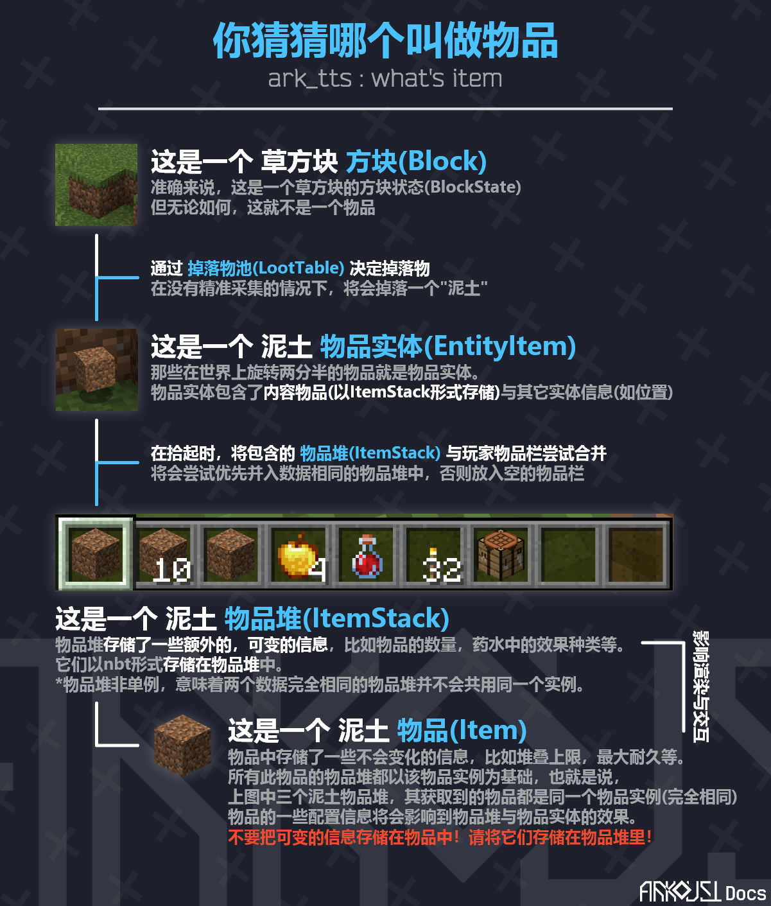
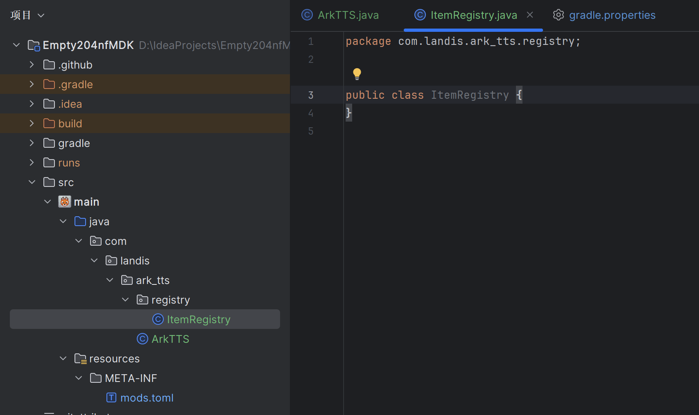
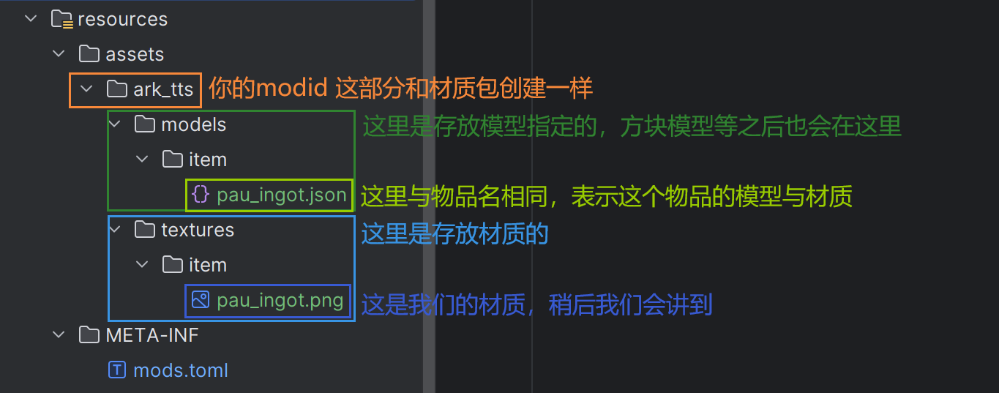
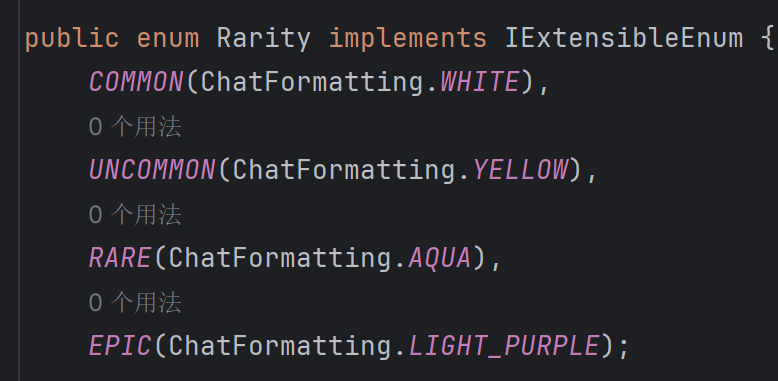

# 物品 基础
这一节我们将正式开始写模组代码，首先我们学习如何创建一个物品。

## 基本概念
首先我们要区分一组概念:物品(Item)与物品堆(ItemStack)，以及方块(Block)与方块物品(BlockItem)

下面是neoforge官方文档，并附上理解翻译：（不想看文字可以看下方图示）

> Before we get further into creating items, it is important to understand what an item actually is,
and what distinguishes it from, say, a block. Let's illustrate this using an example:   
在我们进入如何创建物品之前，有必要了解一下物品(Item)到底是什么，以及它与方块(Block)的区别。让我们用一个例子说明：
>
> <br/>In the world, you encounter a dirt block and want to mine it.This is a block, because it is placed in the world.
(Actually, it is not a block, but a blockstate. See the Blockstates article for more detailed information.)  
在一个世界中，你遇到了一个泥土方块并想把它挖掉。这是一个方块，因为它被放置在世界中。
(实际上，它不是一个方块，而是一个方块状态(BlockState)。更多信息请参考 方块 基础 篇。)//TODO
>
> <br/>Not all blocks drop themselves when breaking (e.g. leaves), see the article on loot tables for more information.
Once you have mined the block, it is removed (= replaced with an air block) and the dirt drops. The dropped dirt is an item entity. 
This means that like other entities (pigs, zombies, arrows, etc.), it can inherently be moved by things like water pushing on it, or burned by fire and lava.  
不是所有方块被破坏时都会掉落它们自身(比如叶子)，请参考掉落物表(LootTable)部分获取更多信息。
一旦你破坏了这个方块，它将被从世界方块列表中移除(也可以说是被替换为空气方块)并掉落一个泥土。这个泥土是一个物品实体(ItemEntity,为LivingEntity的一个子类)。
这意味着它可以像其它物品实体(比如猪，僵尸，箭等)一样被被水或类似的的东西推动，也可以被火和岩浆烧毁。  
(注:你在游戏中看到的掉在地上的物品本质上都是一个物品实体，它包含一个ItemStack表示其包含的物品堆，而该物品堆又指定了其中的物品。物品的一些属性将会影响它们。)
>
> <br/>Once you pick up the dirt item entity, it becomes an item stack in your inventory. 
An item stack is, simply put, an instance of an item with some extra information, such as the stack size.
Item stacks are backed by their corresponding item (which is what we're creating).   
当你你拾起这个泥土物品实体，它就会变成你物品栏中的一个物品堆。简单来说，一个物品堆(ItemStack)就是一个"包含额外信息，比如堆叠上限的物品"的实例。
物品堆由它们包含的物品作为基础(也就是我们将要做的东西)。  
(注:再举个例子，"苹果","附魔书"与"铁剑"是物品，而"24个苹果","时运II的附魔书"与"耐久为40的铁剑"是物品堆，因为后者包含了一些额外的信息。)
> ::: danger WARN  
> **不要把非静态变量写在Item类里，因为所有包含同种物品的物品堆都共用这个物品实例，这么做将会导致一次修改变动所有该种物品(堆)，且在多人模式中几乎不可避免的造成数据不同步。信息保存应使用其ItemStack实例。**
> :::
>
> <br/>Items hold information that is the same across all items (for example, every iron sword has a max durability of 250), 
while item stacks hold information that can be different between two similar items (for example, one iron sword has 100 uses left, while another iron sword has 200 uses left).
For more information on what is done through items and what is done through item stacks, read on.  
物品只应包含那些"在所有此种物品堆中都将相同"的信息，比如每一把铁剑的最大耐久都是250。而物品堆包含的是"两个相似物品(也就是同一个Item)间可能存在差异"的信息，比如一把铁剑还剩100耐久，而另一把还有200耐久。
更多关于"哪些操作应该使用物品进行而哪些应该使用物品堆进行"的信息，请继续往下读。
>
> <br/>The relationship between items and item stacks is roughly the same as between blocks and blockstates, in that a blockstate is always backed by a block. 
It's not a really accurate comparison (item stacks aren't singletons, for example), but it gives a good basic idea about what the concept is here.  
物品与物品堆的关系类似于方块与方块状态的关系(方块的章节在后面，我们还没讲)，正像方块状态由方块作为支撑。这二者的关系并不能完全画等号(比如说，物品堆的设计并不是单例的)，但这仍可以帮助我们理解其基础概念。  
(注:单例是一种特殊的设计模式，简单来说，这个类会被用于创建一个(只有一个)实例，而其它操作都将通过这个实例进行。
物品堆不是单例形式，这意味着可以根据需求创造任意数量的物品堆实例；而方块状态为单例模式，每种方块状态最终只会出现一个实例，所有同种方块在相同状态下都共用这一个方块状态实例。我们会在方块部分再提到这一点。)
>
> <br/>——摘自NeoforgeDocs，[点击此处](https://docs.neoforged.net/docs/items/)查看原文。

:::details 点击查看图片版

:::

## 注册一个物品
让我们来制作一个不会被火烧毁的物品，并为他添加材质:

首先我们创建一个软件包registry用来存储我们的注册类。个人习惯每种注册就创建一个类，当然您想把它们全部写在一个类中也是可以的。

在这个软件包下，创建``ItemRegistry``类:

接下来，我们创建一个延迟注册器用于将我们的物品提交到注册总线中。我们有两种方式创建一个物品的注册器:
```java
public static final DeferredRegister<Item> REGISTER = DeferredRegister.create(Registries.ITEM, ArkTTS.MODID/*这里传入您的modid*/);
public static final DeferredRegister.Items REGISTER = DeferredRegister.createItems(ArkTTS.MODID);
```
这两个方法效果是等价的，您可以选用其中任何一种，这里以第二种为例。再然后，我们要创建一个物品的延迟注册容器:
```java
public static final DeferredItem<Item> PAU_INGOT = REGISTER.register("pau_ingot",()-> new Item(new Item.Properties().fireResistant()));
```
最后，把延迟注册器注册进事件总线:
```java
//在mod主类中:
public ArkTTS(final IEventBus bus){
    ItemRegistry.REGISTER.register(bus);
    //其它内容...
}
```
## 物品材质
虽然说我们已经创建了一个名字为pau_ingot的物品，但很显然，现在我们还没有为它指定材质。

那么，我们需要准备一张最好是16*16大小的贴图，并将其放在如下图位置，再在如图位置创建一个json文件:

在pau_ingot.json内完成以下内容，如果复制请**注意删去注释**:
```json
{
  "parent": "minecraft:item/generated",//如果您使用的是手持物品，比如工具那样的，可以把generated改为handheld
  "textures": {
    "layer0": "ark_tts:item/pau_ingot"//这里就对应着在arkdust的材质包下,item内的pau_ingot贴图。如果您修改了贴图的位置，这里也需要跟着变换
  }
}
```
接下来打开游戏，我们就可以使用指令获取到我们创建的物品了。


## 物品特性(ItemProperties)
物品特性用于描述物品在特定情况下表现出的特征，比如是否可以食用，是否会被，最大耐久度与稀有度(例:金苹果的名字是蓝色的，这个蓝色是使用稀有度设置的)等。

在这里我们只选择了抗火这一条。额外提示一下如何研究这些物品特性。所有可以用properties做到的方法都在net.minecraft.world.item.Item.Properties类中，其它的则需要使用一些特殊手段。
* 看名字，大部分特性的作用都写在名字上了。比如``durability(int pMaxDamage)``这一方法，就是设置耐久度
* 看传参，如果传参为一个非基本类型的对象，那么你或许可以在其类中找到一点线索。比如``rarity(Rarity pRarity)``这个方法，在Rarity类中我们就可以看见: 就可以帮我们推测，这应该是和物品颜色有关了。
* 看用法，原版中大量的物品使用了各种特征，您可以在net.minecraft.world.item.Items类下看到minecraft的物品注册。比如牛奶桶的注册:
  ```java
    public static final Item MILK_BUCKET = registerItem("milk_bucket", new MilkBucketItem(new Item.Properties().craftRemainder(BUCKET).stacksTo(1)));
  ```
  就可以帮助我们理解``craftRemainder(Item pCraftingRemainingItem)``这个方法是配方后留下物品,以及``stacksTo(int pMaxStackSize)``方法是设置堆叠。
* 最后，多试。最简单粗暴也最有效的办法就是设置对照，保持两个物品中一个不变，另一个添加特性，再进游戏观察区别。在现阶段，这将是帮助你解决问题的有效方式。

接下来的内容，我将直接翻译neoforge官方文档，我想这部分应当是比较易懂的。
## 食物
> The Item class provides default functionality for food items, meaning you don't need a separate class for that. To make your item edible, all you need to do is set the ``FoodProperties`` on it through the food method in ``Item.Properties``.  
Item类提供了食物物品的功能，这意味着您不用为其创建一个单独的类。要让您的物品可以被食用，您只需要在``Item.Properties``中设置您的``食物属性(FoodProperties)``。
>
> <br/>FoodProperties are created using a ``FoodProperties.Builder``. You can then set various properties on it:  
食物属性使用``FoodProperties.Builder``来创建，你可以为其配置以下的属性:
>
>* ``nutrition`` - Probably the most obvious part. Sets how many hunger points are restored. Counts in half hunger points, so for example, Minecraft's steak restores 8 hunger points.
营养是最常用的部分，用来设置其食用后可以恢复多少点饥饿值。每1点数代表游戏中的半格饥饿值，例如，烤牛排在游戏中回复4个/*TODO*/，它的营养值是8.
>* ``saturationMod`` - The saturation modifier used in calculating the saturation value restored when eating this food. The calculation is min(2 * nutrition * saturationMod, playerNutrition), meaning that using 0.5 will make the effective saturation value the same as the nutrition value.  
饱和系数用来计算在食用该食物是可以提供的饱和度。其计算公式为:取“二倍营养值与饱和系数的积”与“玩家饥饿值”的小值。这意味着，如果这个数值设置为0.5F，其提供的饱和度将与提供的营养值相等。
>* ``meat`` - Whether this item should be considered meat or not. Used e.g. for determining if healing dogs with this food is possible.  
这一方法用于判断此食物是否为肉类。例如，它可以用于判断这个物品是否可以用于治疗狗勾。
>* ``alwaysEat`` - Whether this item can always be eaten, even if the hunger bar is full. false by default, true for golden apples and other items that provide bonuses beyond just filling the hunger bar.  
这一方法决定了食物是否可以在饱腹状态下食用。默认为false，而像金苹果这样的，除了补充饥饿值还可以提供额外加成的食物通常为true。
>* ``fast`` - Whether fast eating should be enabled for this food. false by default, true for dried kelp in vanilla.  
这一方法决定了物品是否可以被迅速食用。默认为false，而诸如原版的干海带之类是true。这会使物品的食用读条变快。
>* ``effect`` - Adds a MobEffectInstance to apply when eating this item. The second parameter denotes the probability of the effect being applied; for example, Rotten Flesh has an 80% chance (= 0.8) of applying the Hunger effect when eaten. This method comes in two variants; you should use the one that takes in a supplier (the other one directly takes a mob effect instance and is deprecated by NeoForge due to classloading issues).  
效果方法可以在物品被食用时为使用者提供额外的药水效果。第二个参数是决定了该效果被提供给玩家的几率，比如腐肉的数值为0.8F，这意味着腐肉原则上有80%的概率为玩家添加一个饥饿效果。这个方法签名对应着两个方法(也就是俩方法名字相同)，请用使用lambda表达式提供药水效果的那个方法，因为另一个直接传入药水效果实例的方法在使用mod注册的药水效果时，由于neoforge的注册设计会产生报错(这个报错在[注册](registration.md)章节我们提到过)。
>* ``build`` - Once you've set everything you want to set, call build to get a ``FoodProperties`` object for further use.  
在你完成了所有内容的配置后，请调用这个方法来创建一个``食物属性(FoodProperties)``实例。
> <br/>For examples, or to look at the various values used by Minecraft, have a look at the ``Foods`` class.  
如果需要获取使用例或查看Minecraft使用的各种数值，请查看``net.minecraft.world.food.Foods``类。
> <br/>To get the FoodProperties for an item, call ``Item#getFoodProperties(ItemStack, LivingEntity)``. This may return null, since not every item is edible. To determine whether an item is edible, call ``Item#isEdible()`` or null-check the result of the ``getFoodProperties`` call.
如果需要获取一个物品的食物属性，请调用``Item#getFoodProperties(ItemStack, LivingEntity)``方法。由于一些食物并非任何时候都可以食用，这个返回值可能为null。如果需要判断一个物品是否可以食用，您需要使用调用``Item#isEdible()``或检查``getFoodProperties``的返回值是否为null。

这里为大家提供一个示例:
```java
public static final DeferredItem<Item> SUPER_GOLD_APPLE = REGISTER.register("super_gold_apple",SuperGoooooooldApple::new);

    //再创建一个类并继承物品类。如果要对物品进行更复杂的操作，我们就需要这么做。
    public class SuperGoooooooldApple extends Item{
        public static final FoodProperties p = new FoodProperties.Builder()
                .alwaysEat().fast().nutrition(114).saturationMod(0.514F)
                .effect(()->new MobEffectInstance(MobEffects.REGENERATION,3000,5),1)//3000tick的六级生命恢复，概率1(100%)
                .effect(()->new MobEffectInstance(MobEffects.ABSORPTION,1000,3),1)//1000tick的四级伤害吸收，概率1
                .effect(()->new MobEffectInstance(MobEffects.HEAL,200,2),0.8F)//200tick的三级瞬间治疗，概率0.8(80%)
                .build();


        public SuperGoooooooldApple() {
            super(new Properties().food(p).rarity(Rarity.EPIC));
        }
    }
```

