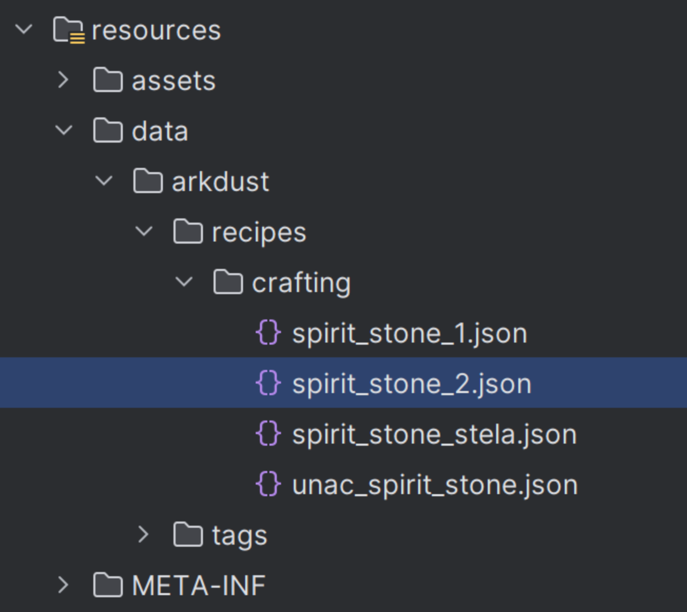

# 注册 基础(仅阅读)

首先我们要知道，为什么需要注册。

正如我们熟知的那样，“注册”用于将一个对象添加到信息的存储库中，比如说方块，物品，生物等。简单来说，就是为每一个对象命名，以方便游戏实现名字与实例的转换。

在Minecraft中，有两种注册方式：一种是由Forge/Neoforge提供的较为传统的方式：ForgeRegistry（下文简称FR）；而剩下的一部分注册需要通过Mojang提供的数据包功能注册：DynamicRegistry（下文简称DR）。目前，比较复杂多变的对象，比如物品，方块，生物等多通过前者注册，而比较适合进行逻辑化且可变性不高的对象，比如生物群系，结构等（其实也很复杂多变，数据包化的代价之一就是极低的可维护性与臃肿的代码调用）则常通过后者注册。一部分功能二者均可以注册。

还有一种较为特殊的注册，它们直接在代码中向BuiltInRegistries注册内容，常见于如结构处理器之类的类，这种注册方式不常用，因此暂且按下不表，在使用到的时候再提及。除此之外，也有一些特别的对象需要用专门的事件进行注册，比如渲染着色器。

在此贴出Neoforge文档中的解释，如果您认为您已经明白了我在上面表达的意思，可以忽略这部分：
> Registration is the process of taking the objects of a mod (such as items, blocks, sounds, etc.) and making them known to the game. Registering things is important, as without registration the game will simply not know about these objects, which will cause unexplainable behaviors and crashes.
>
> Most things that require registration in the game are handled by the Forge registries. A registry is an object similar to a map that assigns values to keys. Forge uses registries with ResourceLocation keys to register objects. This allows the ResourceLocation to act as the "registry name" for objects.
>
> Every type of registrable object has its own registry. To see all registries wrapped by Forge, see the ForgeRegistries class. All registry names within a registry must be unique. However, names in different registries will not collide. For example, there's a Block registry, and an Item registry. A Block and an Item may be registered with the same name example:thing without colliding; however, if two different Blocks or Items were registered with the same exact name, the second object will override the first.
>
> ——from Neoforge docs , https://docs.neoforged.net/docs/concepts/registries

# ForgeRegistry注册方法
判断一个内容是否可以使用FR？可以使用的内容已经被以资源键(ResoureKey)的形式统一存储在了两个类下。一个是net.minecraft.core.registries.Registries，这个类中存储了游戏原版的多种功能的资源键。另一个是net.neoforged.neoforge.registries.NeoForgeRegistries，这份类中存储了forge额外提供的注册类型。

比如说，现在我们要进行一个物品注册，我们首先需要创建一个延时注册器(DeferredRegister)，再向这个注册器中注册新增的内容：

```java 
//在注册类中
public static final DeferredRegister<Item> REGISTER = DeferredRegister.create(Registry.ITEM,"modid");//modid可以修改为您的模组对应的modid

public static final DeferredHolder<Item,Item> NEW_ITEM = REGISTER.register("item_a",()-> new Item(new Item.Properties()));

//一个延迟注册器可以注册多个对象
public static final DeferredHolder<Item,Item> NEW_ITEM_2 = REGISTER.register("item_b",SomeItem::new);
```

上面这段代码只是给大家展示注册器的大致用法，具体如何注册物品我们会在下一篇讲到。

不难发现，首先我们通过DeferredRegister创建了一个延迟注册器，在create方法中指定了我们要注册的对象的类型(Register.ITEM)，再指定了我们模组的modid作为命名空间(Namespace)；最后创建一个延迟容器来存储我们注册的对象，其中register方法的第一个参数是对象的名字，或者准确来说是路径(Path)，后半部分使用lambda表达式传入一个构造对象的方法。

这里有几个注意事项：

1. 一个延迟注册器可以注册多个对象，不要傻不啦叽的每注册一个对象都创建一个延迟注册器。
2. 我们提到了Namespace和Path，它们组合在一起，称为一个资源路径(ResourceLocation)，其中namespace是你的modid，而path是对象的名字。正常情况下资源路径是指定一个目标在资源包中的位置的，但这里我们不难发现，它也同时作为对象的名字使用。
3. 同种对象不可以拥有相同的名字，否则会报错。namespace的设计就是用于防止不同mod之间出现同种对象采用相同名字而产生报错问题的，因此请尽量遵循规则，保证namespace和你的modid一致。
4. 对于一个使用FR的对象，namespace和path都应当遵循仅使用**小写**字母，数字和下划线，或许表示分级的"/"也可以。不能使用大写字母，否则将会报错。
5. 延迟注册器需要注册进事件总线，在上面的示例代码中我们省略了这部分内容。在下篇中会有完整的阐述。
6. 之所以叫做延迟注册，就是因为其并不是在声明变量的时候就将对象进行了注册，而是等相应的事件触发后再将内容注册进游戏，这也是为什么我们传入的是返回对象的lambda表达式而非直接传入对象实例。lambda表达式可以视为是一种以对象形式存储的代码。延迟注册的特性导致您**如果在注册前尝试从延迟容器中获取对象，将会导致获取到的内容为null引起报错**。neoforge已经在计划删除延迟注册功能以避免这类问题。
7. 不同种类的对象可以使用相同的名字。
8. 并非所有上述类中的对象都可以使用forge注册，有一部分被mojang重新设计成使用数据包的形式导致代码无法直接获取到有效的参数。这部分内容大多数和世界生成有关，为旧版本遗留的注册方法。

同时我们还要了解如何获取到对象。还是以物品为例，如果我们在注册完成后，想通过代码获取到item_a，我们可以使用：
```java
Item i = NEW_ITEM.get();
```
而我们如果想要根据对象的资源路径获取对象实例，我们应当使用BuiltinRegistries类下对应的Registry实例或DefaultedRegistry实例。比如对于物品modid:item_a：
```java
Item i = BuiltinRegistries.ITEM.get(new ResourceLocation("modid:item_a"));
Item i2 = BuiltinRegistries.ITEM.get(new ResourceLocation("modid","item_a"));
```
这两个方法的效果相同。而要从实例获取名字，同样需要这个类，使用getKey方法。

# DynamicRegistry注册方法

DynamicRegistry就是大家耳熟能详的数据包注册了，由于我们的教程更侧重于代码且数据包教程在网络上可以搜到很多，本教程中不会提供关于“如何编写数据包”的详细教程，只会提供利用Datagen将实例转换为数据包的教程。但我们在这里还是需要提一下数据包内容向代码实例的转换。

首先要明确，数据包也有名字，比如说我们有一个这样的数据包：

那么对于这个spirit_stone_2.json文件，其名字应该是：
```arkdust:recipes/crafting/spirite_stone_2.json```

如果我们从配方表中获取它，由于配方表会自动指定recipes文件夹内的工作台配方，且默认文件为json文件，在代码中我们真正需要使用的名字应该是：
```arkdust:spirite_stone_2```

这一部分可能会有点难以理解，不过没有关系，首先数据包的名字通常不常用，其次用datagen生成的数据包需要ResourceKey，而ResourceKey就直接代表了对应数据包的名字，因此这一部分只要知道即可，不必深入探究。

最后，了解一下如何在注册阶段之后通过代码获取到数据包生成的实例：

首先我们要获取到level的实例，也就是我们所处的维度，如果是客户端，可以使用Minecraft.getInstance()获取到当前客户端所在的维度；而服务端由于可能处于多维度同时加载的状态，因此不太容易获取，大部分时候使用对应代码位置提供的Level实例。

获取到level实例后，使用registryAccess()获取到注册表访问器，再使用lookup方法，传入对应注册的资源键(ResourceKey，可以在net.minecraft.core.registries.Registries中找到)获取到对应的对象查找器，最后使用get方法传入需要查找的目标的资源键，即可获得Optional的对象。

Optional是一种特殊的类，有两个状态：空或存在。这个类的意义是避免出现目标为null而被意外调用导致出错。具体用法请自行查询java中关于此类的文档。